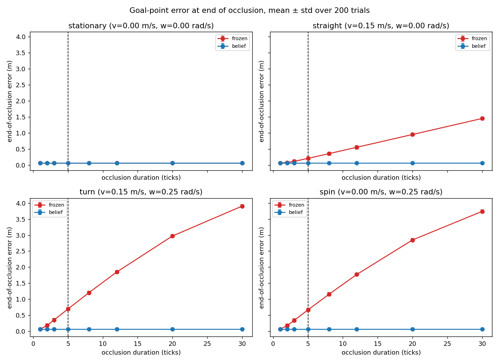
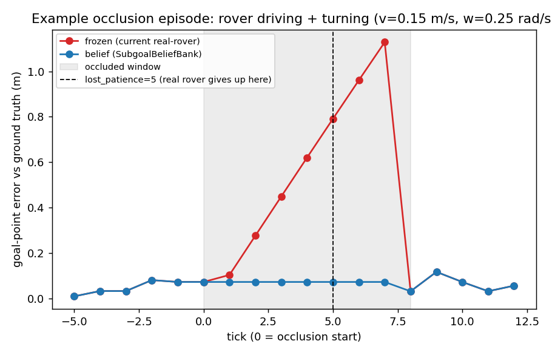
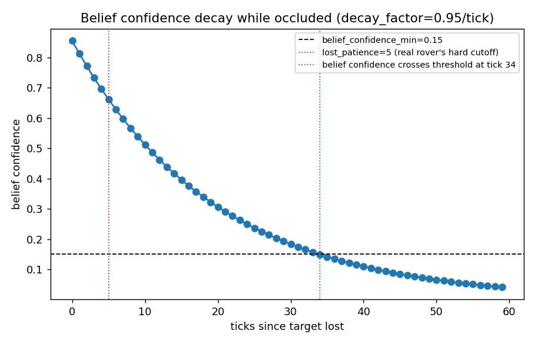

# Belief-on-real-rover evaluation (2026-07-30)

## TL;DR — how to read this

"Error" = how wrong the rover's guess of the target's location is, in meters.
**Lower is better. Zero would be perfect.**

### How wrong is the guess, at the point the real rover currently gives up (5 ticks lost)?

| Scenario | Is the rover moving while target is lost? | Frozen error (today) | Belief error (new idea) | Belief better by | Verdict |
|---|---|---|---|---|---|
| Sitting still | No | 0.06 m | 0.06 m | — | **No difference** — nothing to fix |
| Driving straight | Yes, forward only | 0.21 m | 0.06 m | ~3x lower | **Belief wins** |
| Driving + turning | Yes, forward + turning | 0.70 m | 0.06 m | ~11x lower | **Belief wins clearly** |
| Turning in place (spin) | Yes, rotation only | 0.67 m | 0.06 m | ~10x lower | **Belief wins clearly** |

Reading it: belief's error is the *same* 0.06 m in every row — it isn't
magic, it's just not making the mistake at all. Frozen's error gets worse
the longer the rover moves while blind, and by 30 ticks (10s) it's off by
**3.9 m** in the turning case (see `results.csv` for every duration tested).

### Does the idea have downsides?

| Property | Frozen (today) | Belief (new idea) | Verdict |
|---|---|---|---|
| Accuracy while rover is moving during occlusion | Degrades linearly, badly on turns | Stays near sensor-noise floor | Belief wins |
| Accuracy while rover is still | Same as belief | Same as frozen | Tie |
| "Give up and re-search" patience | Fixed 5 ticks (~1.7s) | 34 ticks (~11.3s) by default | **Frozen's default is safer as-is; belief's default would need retuning**, not a drop-in win |
| Depends on good odometry to work | No (doesn't use odometry at all) | Yes — its whole benefit comes from odometry correction | **Risk**: real rover's odometry is roughest exactly during turns, which is where belief looks best here (see caveat below) |
| Implementation cost | Already shipped | Would need porting + new tuning pass | Frozen is free; belief is not |

**Bottom line: belief is a real, measurable improvement on paper whenever the
rover moves while the target is lost — but two things stop it from being an
easy "just add it": its default patience is way more lenient than today's,
and its entire benefit rides on odometry quality that hasn't been verified
on this rover.** See "The caveat that matters most for the real rover" below.

**What this is:** a synthetic offline simulation, not a live-rover or live-Habitat-sim
test. It compares two rules for estimating the goal point while the target
detection is temporarily lost:

- **frozen** — what the real rover does today (`nav_pipeline/pipeline.py`,
  `_select_detection`/`self._last_goal`): reuse the last-seen robot-frame goal
  point unchanged for up to `lost_patience=5` ticks, then give up and SEARCH.
- **belief** — `SubgoalBeliefBank` from `MARS/mars-habitatsim/navdp/navdp/extensions/belief_bank.py`,
  used today only by the MARS/EARTH Habitat-sim GUIs. Every tick it
  ego-motion-propagates its estimate by the rover's own odometry
  (`ego_motion_update`) and decays a confidence score (`decay_factor=0.95`)
  instead of a hard frame-count cutoff.

Both use the actual project code (not reimplementations). A simulated rover
holds a stationary world-frame target, moves with a known (v, w) only during
the occlusion window (isolates the effect being tested), and both methods'
goal estimate is compared against ground truth. `sigma_visible=0.05`,
`odom_noise=0.02`, `decay_factor=0.95` all match the values `mars_gui.py`
already uses. Odometry fed to `belief` in this test is **exact** (no noise) —
see caveat below, this matters a lot for the real rover.

Script: `scripts/test_belief_vs_frozen.py`. Re-run any time — ~5s on CPU, no GPU/model needed.

## Result 1 — accuracy while stationary vs moving

At `lost_patience=5` ticks (the real rover's actual cutoff), mean end-of-occlusion
error over 200 trials:

| motion | frozen | belief |
|---|---|---|
| stationary (v=0, w=0) | 0.064 m | 0.064 m |
| straight (v=0.15 m/s) | 0.205 m | 0.064 m |
| turn (v=0.15 m/s, w=0.25 rad/s) | 0.696 m | 0.064 m |
| spin (v=0, w=0.25 rad/s) | 0.668 m | 0.064 m |

**When the rover is stationary during the occlusion, frozen and belief are
identical** — freezing is only ever wrong because of the rover's own motion,
not because of the target. **The moment the rover turns while the target is
lost, frozen's error grows roughly linearly with occlusion length and belief's
stays flat at the sensor-noise floor** — by 30 ticks (10s) frozen is off by
~3.8m while belief is still at 0.06m. This matches the mechanism exactly:
`ego_motion_update` re-expresses the stored point in the rover's current
frame every tick; freezing doesn't touch the point at all.

## Result 2 — one representative episode

8-tick occlusion while driving+turning at the real-rover's default caps
(v=0.15 m/s, w=0.25 rad/s). Frozen's error climbs the entire occluded window
and only resets when the target is re-detected (tick 8); belief tracks near
the noise floor throughout.

## Result 3 — confidence decay vs the hard cutoff

`SubgoalBeliefBank`'s default `decay_factor=0.95` doesn't cross the
`belief_confidence_min=0.15` threshold used by the MARS/EARTH GUIs until
**tick 34** (~11.3s at predict_hz=3) — nearly **7x more patient** than the
real rover's `lost_patience=5` (~1.7s) hard cutoff. Adopting belief with its
current default constants as-is would make the rover hold onto (and
potentially drive toward) a lost target for much longer than it does today.
If belief is adopted, `decay_factor` and/or the confidence threshold need
their own real-rover-specific tuning pass — don't inherit the sim defaults
blindly.

## The caveat that matters most for the real rover

**Correction (2026-07-30):** an earlier version of this doc said the rover
has no encoders. That was wrong. It has real per-side quadrature encoders
(`esp32/rover_6wd_complete.ino`) publishing genuinely measured, direction-aware
RPM on `/rover/rpm` — not an open-loop estimate. The caveat below is
narrower than originally stated, but it doesn't disappear.

Belief's entire advantage here comes from `ego_motion_update` correcting the
stored point using odometry — and this test fed it **perfect, noiseless**
odometry. The real rover's odometry (`nav_pipeline/odometry_logger.py`)
integrates that real encoder RPM into x/y/theta via plain differential-drive
dead reckoning, on a 6WD **skid-steer** chassis. The encoders themselves are
accurate — the residual risk is that they measure *wheel rotation*, and on
skid-steer, wheel rotation and true chassis displacement diverge during
turns (the outer/inner wheels don't roll cleanly, they scrub sideways against
the ground), so accurate encoders don't automatically mean accurate turn
odometry the way they would on a differential-drive robot with free-rolling
wheels. The scenario where this test shows belief helping most (`turn`,
`spin`) is also the scenario where wheel-based odometry is intrinsically
weakest on this drivetrain, encoders notwithstanding. This test only
establishes that the *mechanism* (ego-motion propagation > freezing) is sound
*given trustworthy odometry* — it does not establish that the real rover's
actual dead-reckoned odometry is accurate enough through a turn to realize
this benefit. That's the open question a live test would need to answer, and
it's a much cheaper thing to check now than it looked a moment ago (real
encoders exist; it's a question of how much skid-steer slip actually costs,
not whether there's a sensor at all).

## Recommendation

The mechanism is worth porting — freezing is a strictly worse rule than
ego-motion propagation whenever the rover moves during an occlusion, and the
real rover's own tuning history (`search_angular`, `ang_min_cmd` — see
project memory) shows it does turn substantially while re-acquiring targets.
But:

1. Don't swap in `SubgoalBeliefBank` wholesale — port the ego-motion-propagation
   *idea* into `_select_detection`'s existing frozen-goal fallback, reusing
   `ego_motion_update` given the rover's own odometry delta each tick, rather
   than adopting the sim's confidence/decay/distractor-gate machinery
   unmodified.
2. Re-tune `decay_factor`/confidence threshold for the real rover from scratch
   if used — the sim default is ~7x more patient than the current
   `lost_patience=5`, which is a large, untested behavior change on its own
   (see [[feedback-live-rover-tuning]]: change one constant at a time).
2. Before trusting this on hardware, characterize how bad the real
   `/rover/rpm`-based odometry actually is during a turn (e.g. log
   `OdometryLogger`'s dead-reckoned pose against a ground-truth mark on the
   floor over a known turn) — if odometry error during a turn is comparable
   to or larger than frozen's error in that same turn, ego-motion propagation
   buys nothing.
3. If adopted, this is exactly the kind of single-variable, live-validated
   change the last SEARCH-tuning regression was a lesson about — land it
   alone, test it alone, on top of the current re-id/lost_patience mechanism,
   not bundled with other changes.
